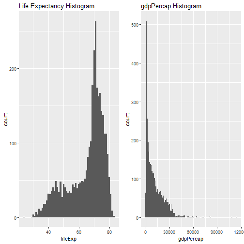
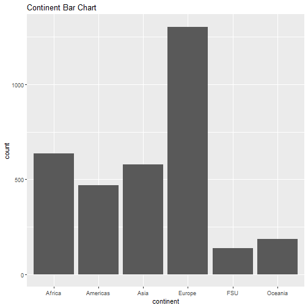
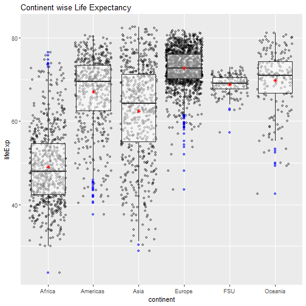
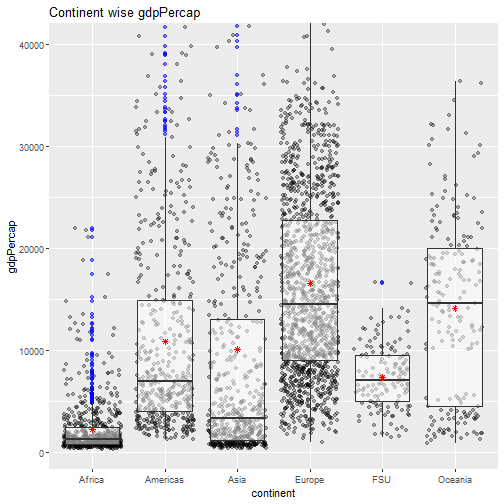
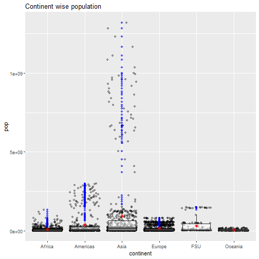
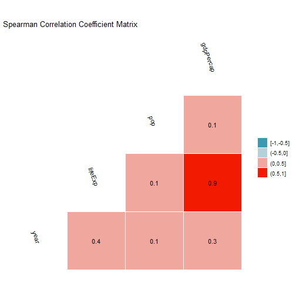
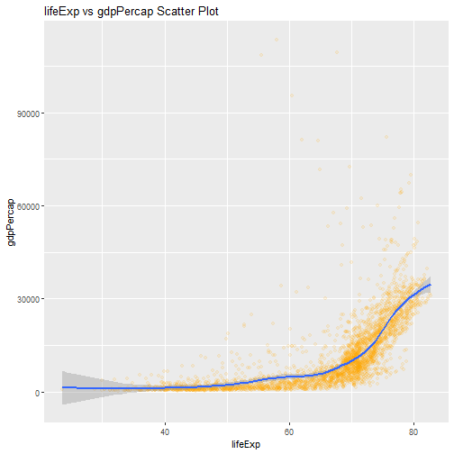
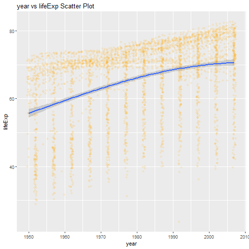
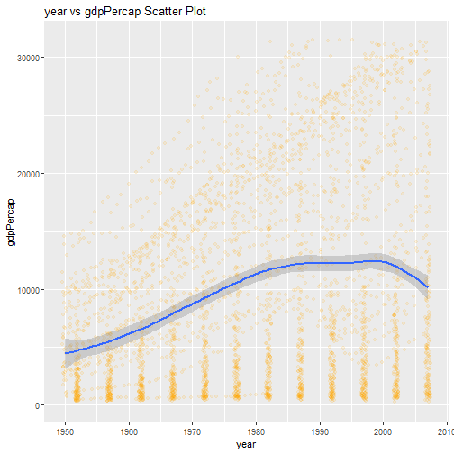
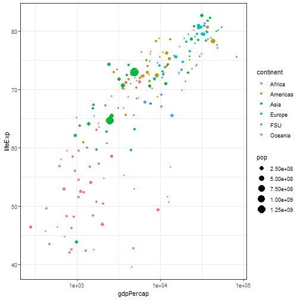

# Gapminder Dataset
This dataset has 6 variables and 3,313 records. This dataset is from R built-in
package gapminder.

# Questions
1. Which Continent has the highest pop, gdpPercap & lifeExp?
2. Does pop, lifeExp, gdpPercap increases with passing years?

Packages Required


Loading dataset into variable df.


```
## Classes 'tbl_df', 'tbl' and 'data.frame':	3313 obs. of  6 variables:
##  $ country  : Factor w/ 187 levels "Afghanistan",..: 1 1 1 1 1 1 1 1 1 1 ...
##  $ continent: Factor w/ 6 levels "Africa","Americas",..: 3 3 3 3 3 3 3 3 3 3 ...
##  $ year     : int  1952 1957 1962 1967 1972 1977 1982 1987 1992 1997 ...
##  $ lifeExp  : num  28.8 30.3 32 34 36.1 ...
##  $ pop      : int  8425333 9240934 10267083 11537966 13079460 14880372 12881816 13867957 16317921 22227415 ...
##  $ gdpPercap: num  779 821 853 836 740 ...
```

Variables are
1. country - representing the country's data
2. continent - represents the continents countries belong to.
3. year - is the year for which the data was takes for that particular country.
4. lifeExp - life expectancy in years, of a person born at that given time.
5. pop - population is the population of the country.
6. gdpPercap - is gross domestic product divided by population.


```
## [1] 0
```

There're no missing records in the dataset.


```
## # A tibble: 6 x 6
##   country     continent  year lifeExp      pop gdpPercap
##   <fct>       <fct>     <int>   <dbl>    <int>     <dbl>
## 1 Afghanistan Asia       1952    28.8  8425333      779.
## 2 Afghanistan Asia       1957    30.3  9240934      821.
## 3 Afghanistan Asia       1962    32.0 10267083      853.
## 4 Afghanistan Asia       1967    34.0 11537966      836.
## 5 Afghanistan Asia       1972    36.1 13079460      740.
## 6 Afghanistan Asia       1977    38.4 14880372      786.
```

Few records from the dataset showing the data.

# Univariate Analysis



These histograms show the distribution of gdpPercap & lifeExp variables.



Europe has highest number of records in the dataset.

# Bivariate Analysis

## Question 1 - Which Continent has the highest pop, gdpPercap & lifeExp?



This boxplot depicts that Europe has the highest life expectancy.



This boxplot depicts that Europe has the highest GDP Per Capita.



Asia has the highest population.



Looking at the coefficient correlation matrix, lifeExp & gdpPercap has the 
strongest correlation.



This is the strongest relation and gdp increases if life expectancy is 60 
or greater.

## Question 2 - Does lifeExp, gdpPercap increases with passing years?



This plot depicts with passing years Life Expectancy is increasing.



Here looking at the plot, looks that gdpPercap has weak correlation with years.

# Multivariate Analysis



```
## Error in gList(structure(list(x = structure(list(data = list(list(x = c(3.79402544509666, : only 'grobs' allowed in "gList"
```

This bubble chart is plotted only for year 2007, for all the continents.
Looking at this bubble chart, Europe & Americas have maximum gdpPercap with 
maximum lifeExp.
